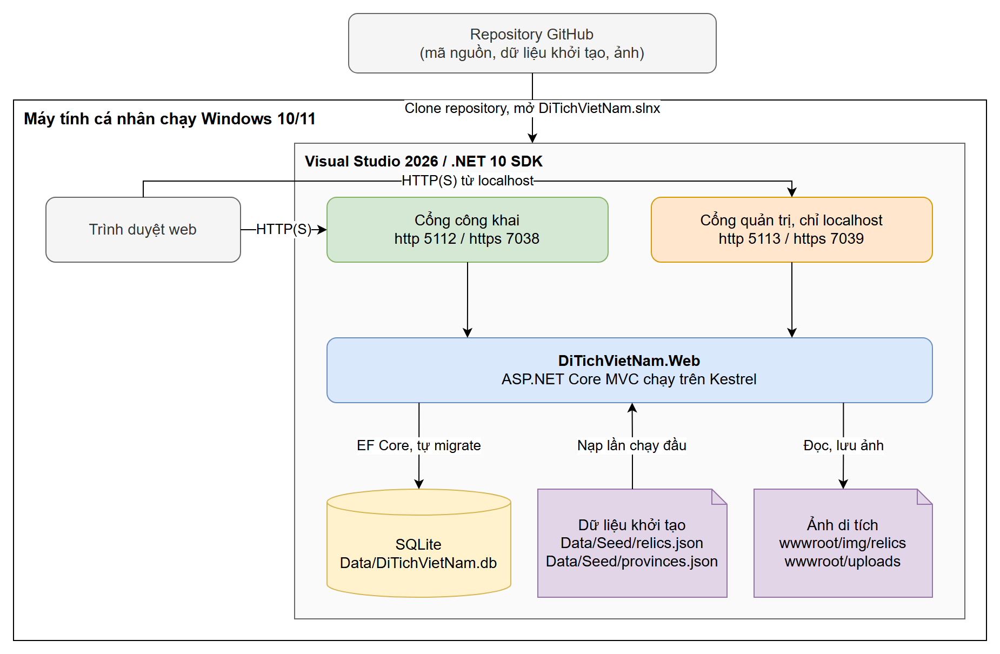

# Hướng dẫn cài đặt và chạy chương trình

Thư mục này hướng dẫn cài đặt website Di tích Việt Nam trên máy Windows bằng Visual Studio. Mọi thành phần cần để chạy đều có sẵn trong repository: mã nguồn, migration tạo cơ sở dữ liệu, dữ liệu khởi tạo và ảnh. Cơ sở dữ liệu là SQLite và được tạo tự động ở lần chạy đầu, nên không phải cài thêm hệ quản trị cơ sở dữ liệu nào.

## 1. Sơ đồ triển khai

Tệp gốc của sơ đồ là `deployment-diagram.drawio`, mở bằng [draw.io](https://www.drawio.com) để chỉnh sửa.

## 2. Yêu cầu môi trường

| Thành phần | Yêu cầu |
|---|---|
| Hệ điều hành | Windows 10 hoặc Windows 11, 64 bit |
| Visual Studio | Visual Studio 2026, cài workload **ASP.NET and web development** |
| .NET SDK | .NET 10, đã đi kèm workload trên; nếu thiếu thì tải riêng tại trang tải .NET 10 |
| Git | Chỉ cần khi tải mã nguồn bằng dòng lệnh |

Theo trang tải .NET 10 của Microsoft, Visual Studio 2026 là phiên bản hỗ trợ .NET 10 SDK. Workload ASP.NET and web development là workload Microsoft yêu cầu cho dự án ASP.NET Core MVC.

## 3. Các bước cài đặt

1. Cài Visual Studio 2026. Trong Visual Studio Installer, chọn workload ASP.NET and web development rồi bấm Install.
2. Tải mã nguồn. Trong Visual Studio chọn **Clone a repository** và dán địa chỉ repository, hoặc chạy `git clone <địa chỉ repository>`.
3. Mở tệp `src/DiTichVietNam/DiTichVietNam.slnx`. Ở lần mở đầu, Visual Studio tự khôi phục các gói NuGet.
4. Trên thanh công cụ, chọn profile `http` rồi bấm F5 để chạy, hoặc Ctrl+F5 để chạy không gỡ lỗi.

Ở lần chạy đầu, ứng dụng tự áp dụng migration để tạo tệp `Data/DiTichVietNam.db`, sau đó nạp dữ liệu khởi tạo. Không cần chạy lệnh `dotnet ef`.

## 4. Địa chỉ truy cập

| Profile | Trang công khai | Khu quản trị |
|---|---|---|
| `http` | http://localhost:5112 | http://localhost:5113/tai-khoan/dang-nhap |
| `https` | https://localhost:7038 | https://localhost:7039/tai-khoan/dang-nhap |

Khu quản trị chạy trên cổng riêng. Mở đường dẫn quản trị trên cổng công khai sẽ nhận trang không tìm thấy.

Profile `https` cần máy tin chứng chỉ phát triển của ASP.NET Core. Visual Studio sẽ hỏi ở lần chạy đầu. Nếu bỏ qua bước đó thì chạy lệnh `dotnet dev-certs https --trust`.

Tài khoản quản trị khởi tạo là `admin@ditich.vn`, mật khẩu `Admin@123`. Sau lần đăng nhập đầu nên đổi mật khẩu trong mục tài khoản.

## 5. Dữ liệu thử

Các đường dẫn dưới đây tính từ thư mục `src/DiTichVietNam/DiTichVietNam.Web`.

| Tệp hoặc thư mục | Nội dung |
|---|---|
| `Data/Seed/relics.json` | 209 bản ghi di tích và di sản văn hóa phi vật thể, mỗi bản ghi có nguồn |
| `Data/Seed/provinces.json` | 34 tỉnh thành |
| `wwwroot/img/relics` | 216 ảnh, mỗi ảnh có nguồn ghi trong `relics.json` |

Đây là bộ dữ liệu cho các kết quả trình bày ở Chương 4 của quyển báo cáo. Muốn đưa website về dữ liệu ban đầu thì dừng ứng dụng, xóa `Data/DiTichVietNam.db` (kèm hai tệp `-shm`, `-wal` nếu có) và thư mục `wwwroot/uploads`, rồi chạy lại.

## 6. Lỗi thường gặp

| Hiện tượng | Cách xử lý |
|---|---|
| Visual Studio báo không tìm thấy .NET 10 | Mở Visual Studio Installer, cập nhật Visual Studio 2026 hoặc cài .NET 10 SDK |
| Báo cổng đang được dùng | Tắt ứng dụng đang chiếm cổng 5112 hoặc 5113, hoặc đổi cổng trong `Properties/launchSettings.json` và mục `AdminSite` của `appsettings.json` |
| Trình duyệt cảnh báo chứng chỉ ở profile `https` | Chạy `dotnet dev-certs https --trust`, hoặc dùng profile `http` |

## Nguồn tham khảo

- Microsoft, "Get started with ASP.NET Core MVC", Microsoft Learn: https://learn.microsoft.com/aspnet/core/tutorials/first-mvc-app/start-mvc
- Microsoft, "Install Visual Studio", Microsoft Learn: https://learn.microsoft.com/visualstudio/install/install-visual-studio
- Microsoft, "Download .NET 10.0": https://dotnet.microsoft.com/download/dotnet/10.0
- Microsoft, "Clone a Git repository in Visual Studio", Microsoft Learn: https://learn.microsoft.com/visualstudio/version-control/git-clone-repository
- Microsoft, "Enforce HTTPS in ASP.NET Core", mục tin chứng chỉ phát triển, Microsoft Learn: https://learn.microsoft.com/aspnet/core/security/enforcing-ssl
- Microsoft, "Applying Migrations", EF Core, Microsoft Learn: https://learn.microsoft.com/ef/core/managing-schemas/migrations/applying
- Git, "Downloads": https://git-scm.com/downloads
